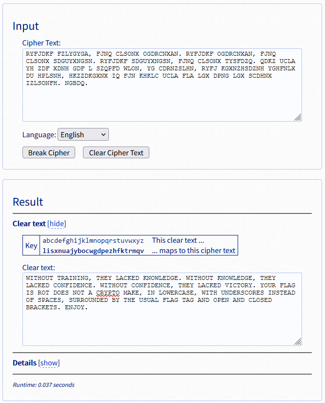

file:bitrot
```

RYFJDKF FZLYGYGA, FJNQ CLSONX OGDRCNXAN. RYFJDKF OGDRCNXAN, FJNQ CLSONX SDGUYXNGSN. RYFJDKF SDGUYXNGSN, FJNQ CLSONX TYSFDZQ. QDKZ UCLA YH ZDF XDNH GDF L SZQPFD WLON, YG CDRNZSLHN, RYFJ KGXNZHSDZNH YGHFNLX DU HPLSNH, HKZZDKGXNX IQ FJN KHKLC UCLA FLA LGX DPNG LGX SCDHNX IZLSONFH. NGBDQ.

```

### This isn't bitrot - Resolution

Substitution Solver - <https://www.guballa.de/substitution-solver>



```

WITHOUT TRAINING, THEY LACKED KNOWLEDGE. WITHOUT KNOWLEDGE, THEY LACKED CONFIDENCE. WITHOUT CONFIDENCE, THEY LACKED VICTORY. YOUR FLAG IS ROT DOES NOT A CRYPTO MAKE, IN LOWERCASE, WITH UNDERSCORES INSTEAD OF SPACES, SURROUNDED BY THE USUAL FLAG TAG AND OPEN AND CLOSED BRACKETS. ENJOY.

```

ROT DOES NOT A CRYPTO MAKE

DOCTF{rot_does_not_a_crypto_make}


``` Flag : DOCTF{rot_does_not_a_crypto_make} ```