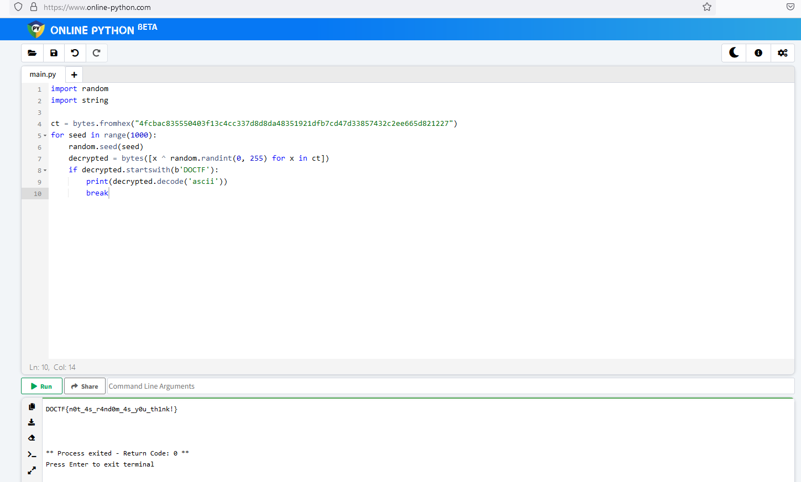

file: out.txt
```

4fcbac835550403f13c4cc337d8d8da48351921dfb7cd47d33857432c2ee665d821227

```

file: encrypt.py
```

#!/usr/bin/env python3
import random

with open('flag.txt', 'r') as f:
    flag = f.read()

seed = random.randint(0,999)
random.seed(seed)

encrypted = ''.join(f'{(ord(c) ^ random.randint(0,255)):02x}' for c in flag)

with open('out.txt', 'w') as f:
    f.write(encrypted)

```

### Lightning Seeds - Resolution

```

import random
import string

ct = bytes.fromhex("4fcbac835550403f13c4cc337d8d8da48351921dfb7cd47d33857432c2ee665d821227")
for seed in range(1000):
    random.seed(seed)
    decrypted = bytes([x ^ random.randint(0, 255) for x in ct])
    if decrypted.startswith(b'DOCTF'):
        print(decrypted.decode('ascii'))
        break

```

[Online Python](https://www.online-python.com/)




``` Flag : DOCTF{n0t_4s_r4nd0m_4s_y0u_th1nk!} ```