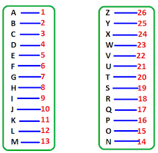

file: transcript.txt
```

*Lincolnshire poacher plays*
*A femenine voice starts reading numbers*
23, 8, 1, 20, 1
23, 8, 1 ,20, 1

23, 5, 9, 18, 4
23, 5, 9, 18, 4

19, 20, 1, 20, 9
19, 20, 1, 20, 9

15, 14
15, 14

*transmission ends*

```

### Numbers Station - Resolution

Some links about the Radio Stations and the cryptographic methods used:

- <https://warontherocks.com/2018/05/explaining-the-mystery-of-numbers-stations/>
- <https://github.com/macubergeek/ctf/blob/master/docs/secretfr.txt>
- <https://www.boxentriq.com/code-breaking/one-time-pad>
- <https://www.techtarget.com/searchsecurity/definition/one-time-pad>

The methos is to translate each number to the corresponding alphabet letter position.



23, 8, 1, 20, 1, 23, 5, 9, 18, 4, 19, 20, 1, 20, 9, 15, 14

| 23 | 8 | 1 | 20 | 1 | 23 | 5 | 9 | 18 | 4 | 19 | 20 | 1 | 20 | 9 | 15 | 14 |
| w  | h | a | t  | a | w  | e | i | r  | d | s  | t  | a | t  | i | o  | n  |


``` Flag : DOCTF{whataweirdstation} ```