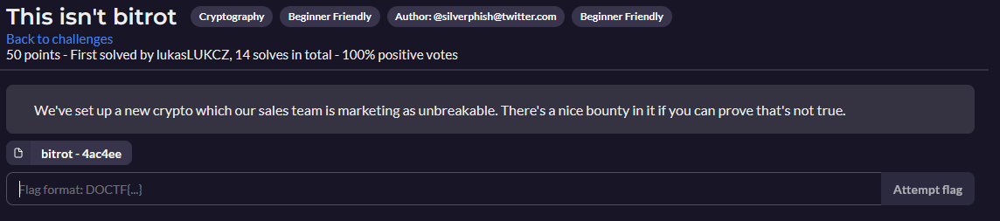

# Cryptography
- [Cryptography](#cryptography)
  - [Lightning Seeds](#lightning-seeds)
  - [Numbers Station](#numbers-station)
  - [Nintendhash](#nintendhash)
  - [The Rat](#the-rat)
  - [Essence of Symmetry](#essence-of-symmetry)
  - [Hacker's Gambit](#hackers-gambit)
  - [This isn't bitrot](#this-isnt-bitrot)

---

## Lightning Seeds

Flag - [Lightning Seeds Resolution](Lightning_Seeds/README.md)

---

## Numbers Station

Flag - [Numbers Station Resolution](Numbers_Station/README.md)

---

## Nintendhash

---

## The Rat

[The Rat Resolution](The_Rat/README.md)

---

## Essence of Symmetry

---

## Hacker's Gambit

[Hacker's Gambit Resolution](Hackers_Gambit/README.md)

---

## This isn't bitrot

[This isn't bitrot Resolution](Bitrot/README.md)

---
