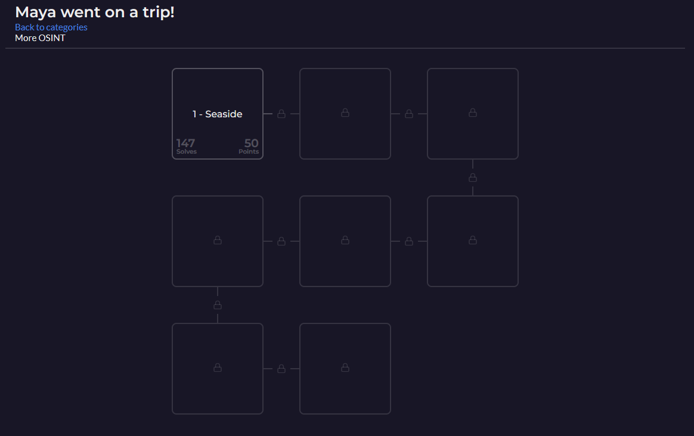
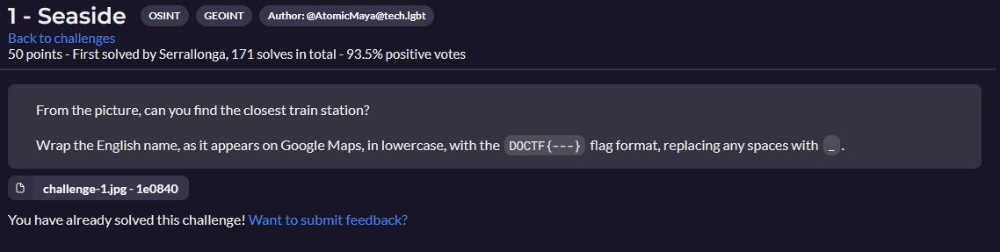
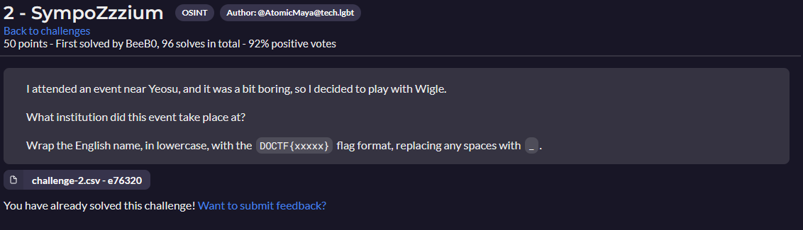
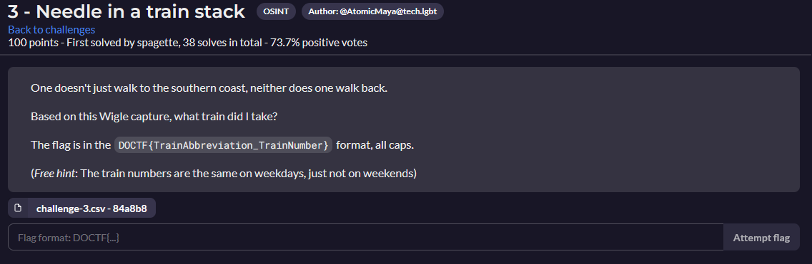
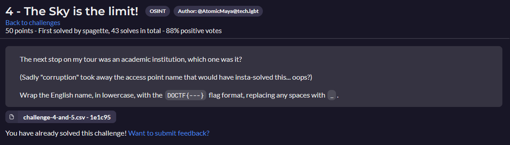
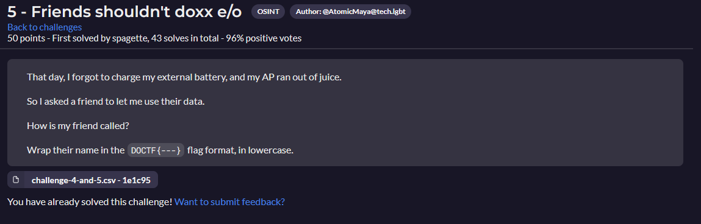
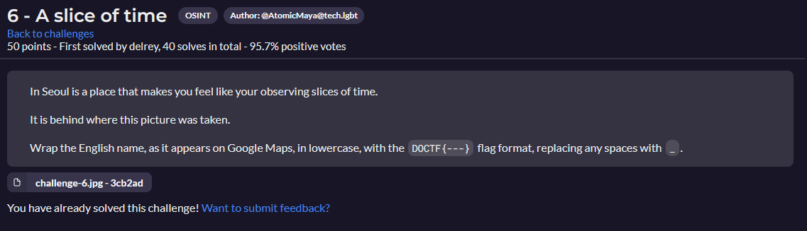
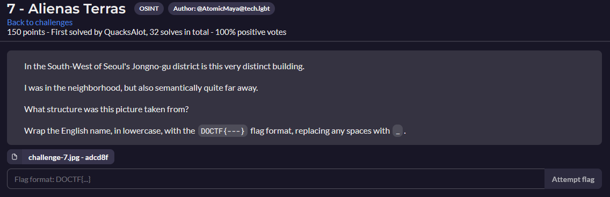

# Maya went on a trip!

- [Maya went on a trip!](#maya-went-on-a-trip)
  - [1 - Seaside](#1---seaside)
  - [2 - SympoZzzium](#2---sympozzzium)
  - [3 - Needle in a train stack](#3---needle-in-a-train-stack)
  - [4 - The Sky is the limit!](#4---the-sky-is-the-limit)
  - [5 - Friends shouldn't doxx e/o](#5---friends-shouldnt-doxx-eo)
  - [6 - A slice of time](#6---a-slice-of-time)
  - [7 - Alienas Terras](#7---alienas-terras)
  - [8 -](#8--)

---

## 1 - Seaside

[Seaside Resolution](Seaside/README.md)

---

## 2 - SympoZzzium

[SympoZzzium Resolution](SympoZzzium/README.md)

---

## 3 - Needle in a train stack

[Needle in a train stack Resolution](Needle/README.md)

---

## 4 - The Sky is the limit!

[The Sky is the limit! Resolution](Sky/README.md)

---

## 5 - Friends shouldn't doxx e/o

[Friends shouldn't doxx e/o Resolution](Friends/README.md)

---

## 6 - A slice of time

[A slice of time Resolution](Slice/README.md)

---

## 7 - Alienas Terras

[Alienas Terras Resolution](Terras/README.md)

---

## 8 - 
