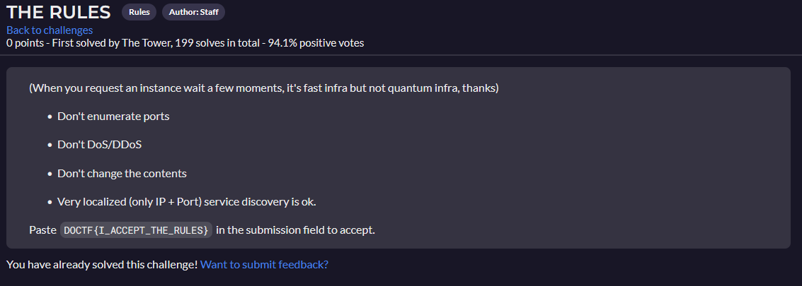
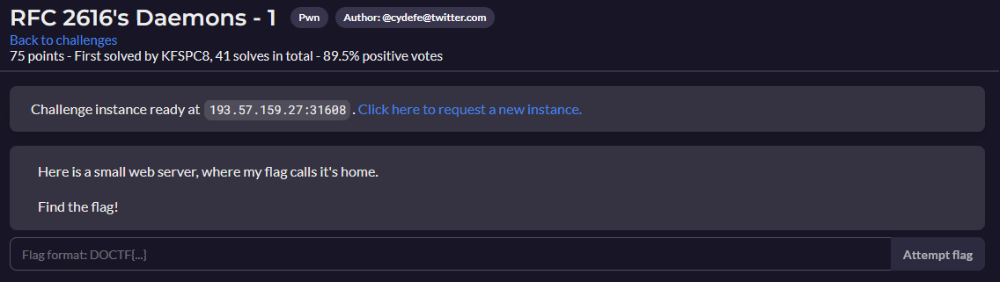
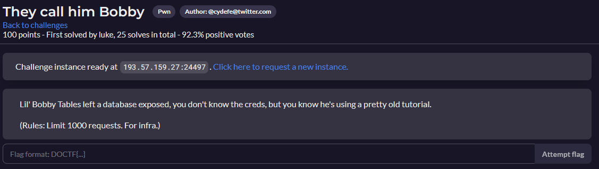
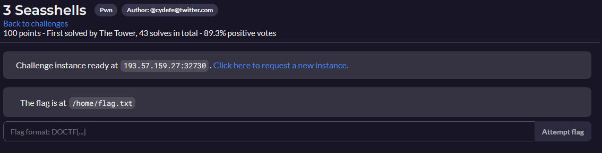
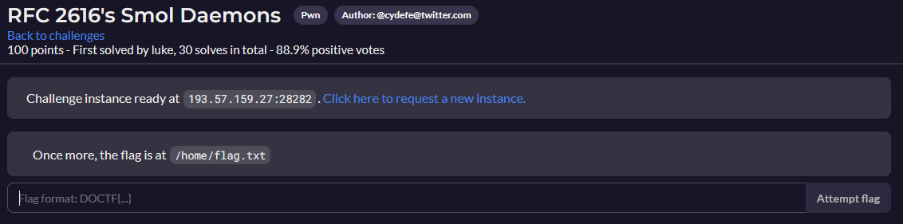
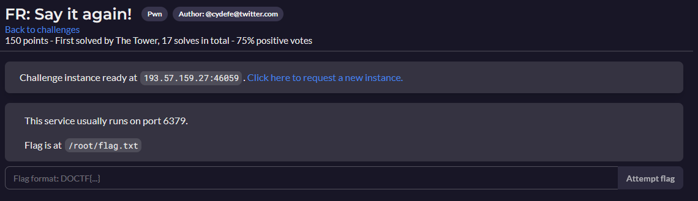
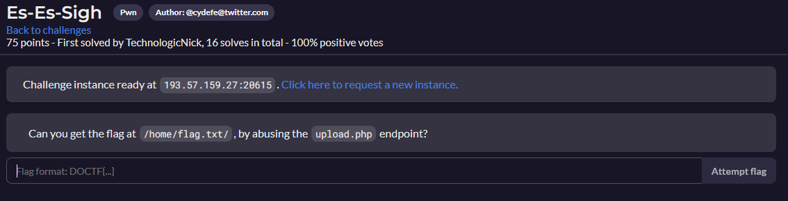

# PWN
- [PWN](#pwn)
  - [THE RULES](#the-rules)
  - [RFC 2616's Daemons - 1](#rfc-2616s-daemons---1)
  - [They call him Bobby](#they-call-him-bobby)
  - 
  - [3 Seasshells](#3-seasshells)
  - [RFC 2616's Smol Daemons](#rfc-2616s-smol-daemons)
  - [FR: Say it again!](#fr-say-it-again)
  - [Es-Es-Sigh](#es-es-sigh)

---

## THE RULES

No Flag - [THE RULES Resolution](rules/README.md)

---

## RFC 2616's Daemons - 1

No Flag - [RFC 2616's Daemons - 1 Resolution](rfc/README.md)

---

## They call him Bobby

No Flag - [They call him Bobby Resolution](Bobby/README.md)

---

## 

---

## 3 Seasshells

No Flag - [3 Seasshells Resolution](Seasshells/README.md)

---

## RFC 2616's Smol Daemons

No Flag - [RFC 2616's Smol Daemons Resolution](smol/README.md)

---

## FR: Say it again!

No Flag - [FR: Say it again! Resolution](Say/README.md)

---

## Es-Es-Sigh

No Flag - [Es-Es-Sigh Resolution](Sigh/README.md)

---