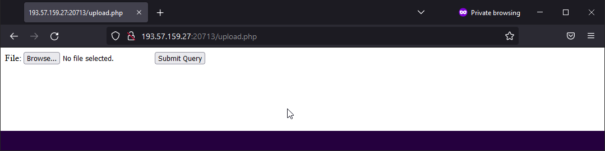
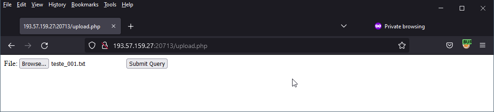
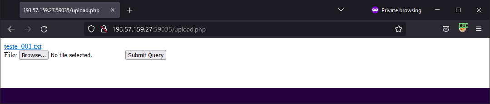
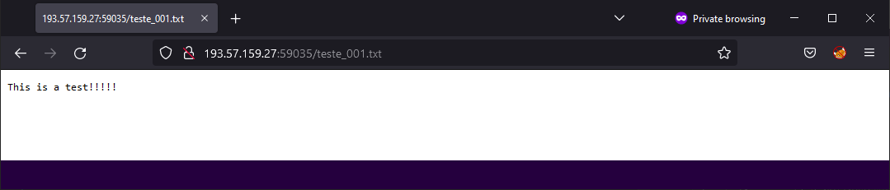
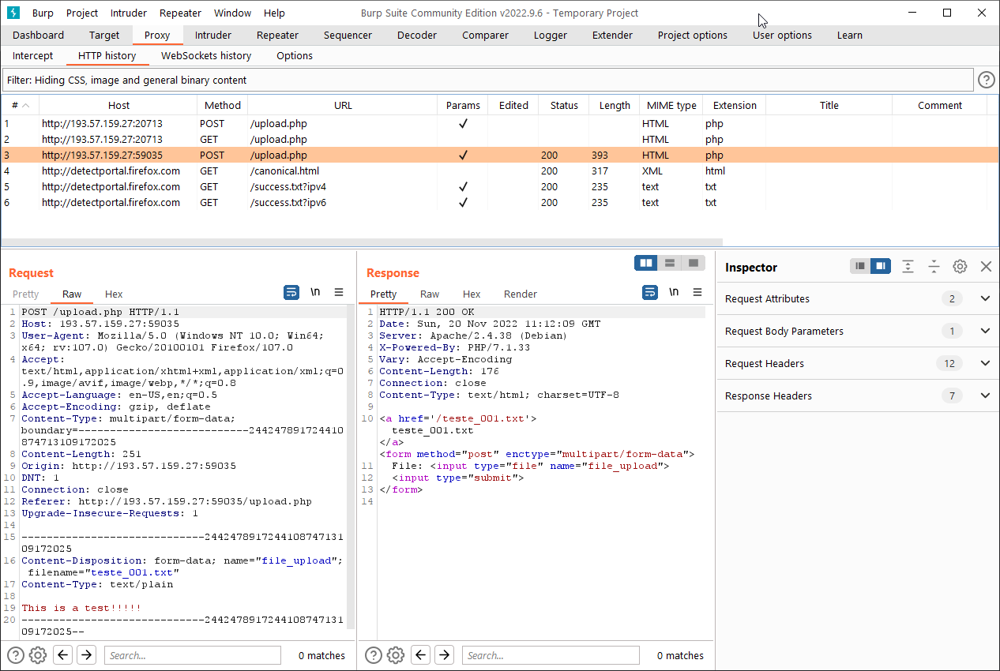
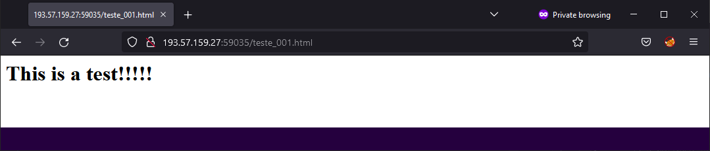
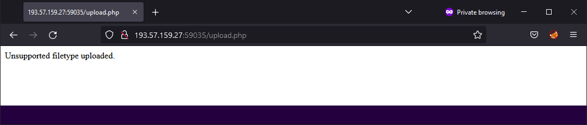
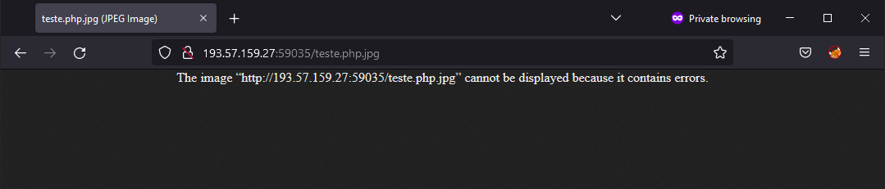
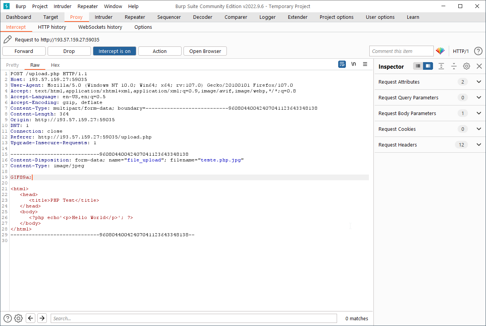

# Es-Es-Sigh



### Es-Es-Sigh  - Resolution

- Shell the web - Methods of a Ninja - <http://www.securityidiots.com/Web-Pentest/hacking-website-by-shell-uploading.html>
- Image upload bypass - <https://d00mfist.gitbooks.io/ctf/content/bypass_image_upload.html>

1 - txt file









2 - html file



2 - php file



3 - php file "teste.php.jpg"



4 - php file "teste.php.jpg" and add "GIF89a;" on the request




``` Flag :  ```
