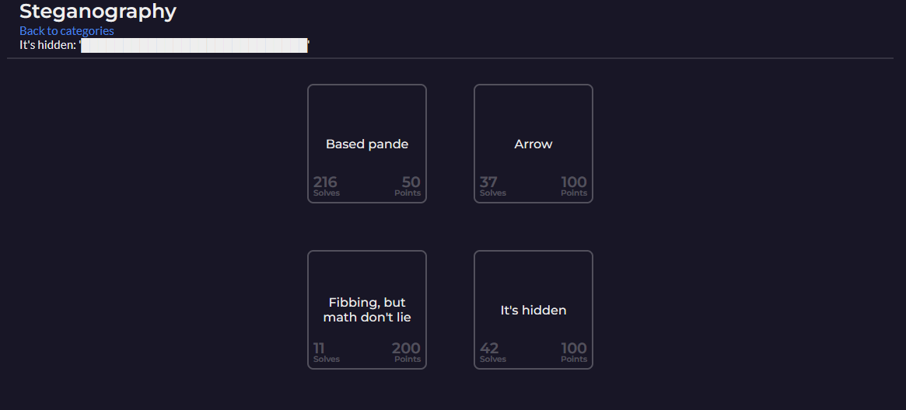
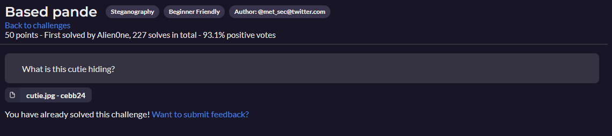
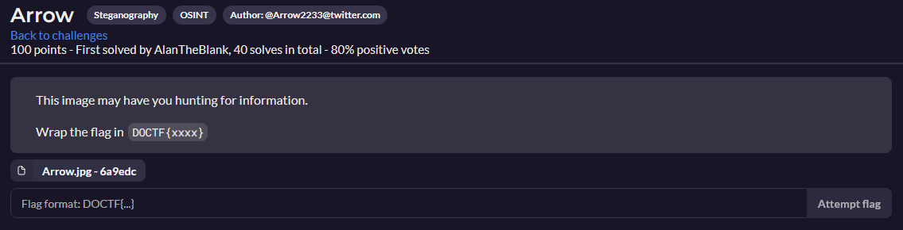
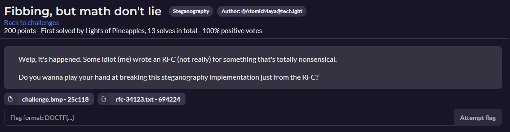
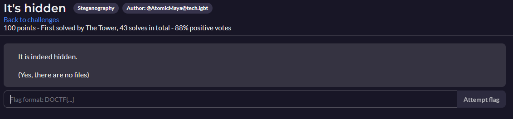

# Steganography
- [Steganography](#steganography)
  - [Based pande](#based-pande)
  - [Arrow](#arrow)
  - [Fibbing, but math don't lie](#fibbing-but-math-dont-lie)
  - [It's hidden](#its-hidden)

---

## Based pande

[Based pande Resolution](Based_pande/README.md)

---

## Arrow

---

## Fibbing, but math don't lie

---

## It's hidden

