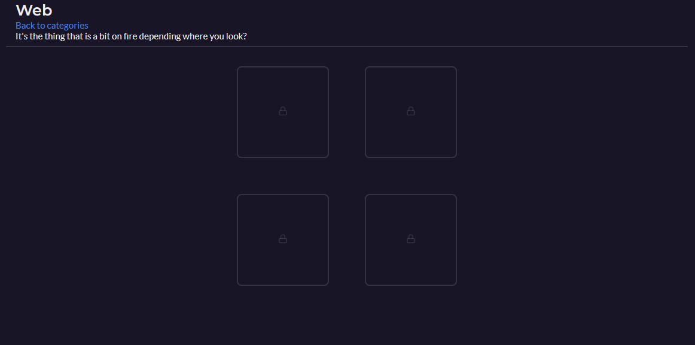
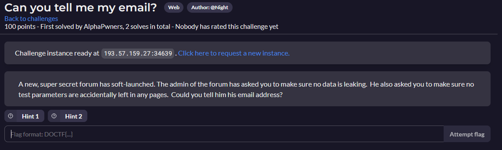
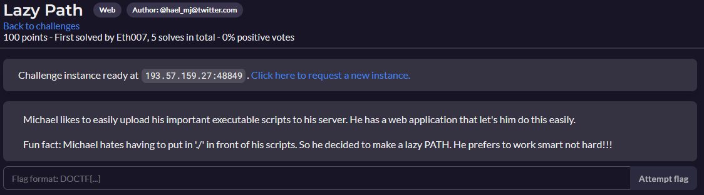
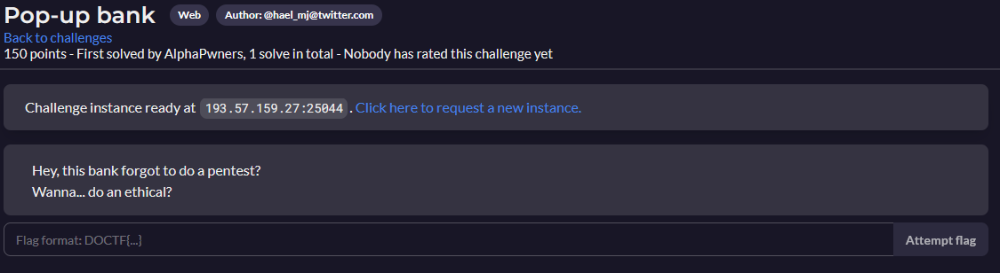
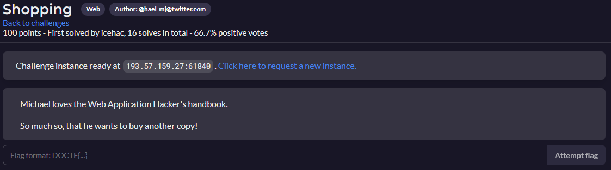
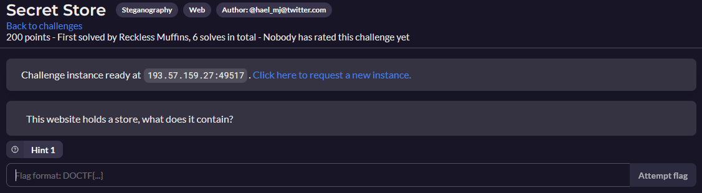

# Web

- [Web](#web)
  - [Can you tell me my email?](#can-you-tell-me-my-email)
  - [Lazy Path](#lazy-path)
  - [Pop-up bank](#pop-up-bank)
  - [Shopping](#shopping)
  - [Secret Store](#secret-store)

<https://github.com/pedroaovieira/ctf/blob/main/04_Web/020_web.md>

---

## Can you tell me my email?

[Can you tell me my email? Resolution](Email/README.md)

---

## Lazy Path

[Lazy Path Resolution](Path/README.md)

Upload a webshell?

Upload a reverse shell?

---

## Pop-up bank

[Pop-up bank Resolution](Pop_up/README.md)

---

## Shopping

[Shopping Resolution](Shopping/README.md)

---

## Secret Store

[Secret Store Resolution](Secret_Store/README.md)

---
